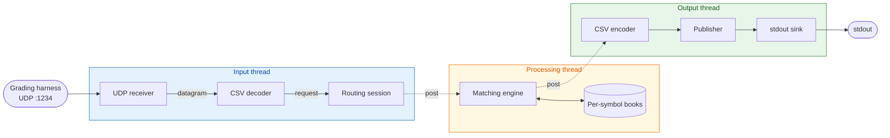

# Kraken Order Book -- Senior Submission

Multi-threaded UDP order book matching engine.

Core matching logic lives in the `matching_engine/v3` module.

## Architecture

Data flows from inbound UDP packets through the matching engine and out
as market data, with SPSC queues between thread boundaries, driven by
spinning event loops.

### Conceptual data flow



### Application Composition Tree


## Highlights

- **Fast.** ~12 ns p99 insert and ~10 ns p99 cancel at a realistic
  200-order single-level depth on the production
  `matching_engine::v3::flat_order_book`; see
  [`docs/performance.md`](docs/performance.md) for the percentile chart and
  methodology.
- **Resilient.** Clean build under GCC and Clang, with all sanitiser
  combinations green and zero warnings against a flag set well beyond
  `-Wall -Wextra`.
- **Modular.** Every pipeline stage -- including the UDP backend and
  the matching engine itself -- plugs in behind a typed seam and
  swaps without touching the rest of the code.
- **Safe by design.** Strong types, exhaustive switches, structured
  errors, and a clean runtime / domain split move whole classes of
  bug to compile time.
- **Configurable.** Reshape the system -- threading, idle strategies,
  backends, sinks -- by changing config, not code.

See [`docs/highlights.md`](docs/highlights.md) for the longer version.

## Threading model

Three threads, each running a `kraken::event_loop` whose primary
queue is a single-producer / single-consumer blocking queue. The
producing thread `post()`s a closure onto the consuming thread's
loop; the consumer dequeues and runs the closure synchronously on
its own thread.

Each loop's idle behaviour -- what the consumer does when both the
task queue and the pollers are empty -- is selected per loop through
`kraken::event_loop_config::idle_strategy`. The submission is an HFT
pipeline, so `kraken_submission::config` defaults all three loops to
`kraken::busy_spin_idle`: the consumer never sleeps, never wakes, and
the next iteration starts as soon as the previous one ends. The
loop primitive itself defaults to `kraken::timed_wait_idle` for
non-HFT consumers.

| Thread | Stages it owns | Notes |
|--------|----------------|-------|
| Input | UDP receiver, CSV decoder, routing session | The asio `io_context` runs as a non-blocking poller against the same loop, so datagrams advance in line with posted tasks. |
| Processing | Matching engine, per-symbol books | Pure synchronous chain over posted requests; no pollers. |
| Output | CSV encoder, publisher, stdout sink | The publisher is the sole writer of stdout, so no per-record locking. |

Inside any one thread, the stages run as a direct synchronous chain;
no stage knows it lives behind an event loop.

## Components

Each library has its own README; click through for the responsibility
statement and the pointers to the ADRs that explain its shape.

| Library | Role |
|---------|------|
| [`kraken`](submission/src/kraken/) | General-purpose utilities ("our internal Boost"). |
| [`order_routing`](submission/src/order_routing/) | Inbound domain. UDP bytes to typed routing requests. |
| [`matching_engine`](submission/src/matching_engine/) | The main trading domain. Per-symbol order books and the matching loop. |
| [`market_data`](submission/src/market_data/) | Outbound domain. Typed messages to CSV records on stdout. |
| [`kraken_submission`](submission/src/kraken_submission/) | Wiring shell. Owns the three event loops and the executable. |

Where it helps to see a library used in isolation, a runnable example
program lives alongside it (under the library's own `examples/`
directory). The per-library README points at its examples.

## Where to read next

| You want... | Open... |
|-------------|---------|
| The problem statement | [`EXERCISE.md`](EXERCISE.md) |
| The technical pitch in one page | [`docs/highlights.md`](docs/highlights.md) |
| How the project thinks about C++ | [`docs/cpp-design-principles.md`](docs/cpp-design-principles.md) |
| Showcase of applied principles in code | [`docs/showcase.md`](docs/showcase.md) |
| Why we made the major choices | [`DESIGN.md`](DESIGN.md) |
| Architectural decisions with full reasoning | [`docs/adr/`](docs/adr/) |
| A map of the source tree | [`submission/README.md`](submission/README.md) |
| The matching engine spec | [`docs/engine-specs.md`](docs/engine-specs.md) |
| How the application wires itself together at startup | [`docs/runtime-startup.md`](docs/runtime-startup.md) |
| The event loop primitive each thread runs | [`docs/event-loop.md`](docs/event-loop.md) |
| Dependency strategy and inventory | [`DEPENDENCIES.md`](DEPENDENCIES.md) |
| Build presets and developer setup | [`DEVELOPING.md`](DEVELOPING.md) |
| How to tune the host for production-grade latency | [`docs/tuning-guide.md`](docs/tuning-guide.md) |

## Quick Start

Build and run the Docker-based black-box test suite:

```bash
./run_submission.sh                       # builds the image and runs the UDP harness
./run_submission.sh -m stdin              # use the stdin test harness instead
```

Reports are written to `./reports/` (JUnit XML and HTML).

## Local Development

`build.sh` wraps CMake configure, build, and `ctest`:

```bash
./build.sh                                # debug preset, all targets, run tests
./build.sh release                        # optimized build
./build.sh asan kraken_submission         # named preset and target
```

See [`DEVELOPING.md`](DEVELOPING.md) for setup, available presets, and
project conventions.

## Layout

```
.
|-- submission/        Source, unit tests, microbenchmarks (binary: kraken_submission)
|-- test/              Docker-based black-box harness (do not modify)
|-- cmake/             Shared CMake modules
|-- scripts/           Developer scripts (formatting, pre-commit)
|-- docs/              ADRs, C++ design principles, engine spec, runtime and event-loop docs, performance
|-- Dockerfile         Ubuntu 24.04 image used by the assessment
|-- build.sh           CMake configure + build + ctest wrapper
`-- run_submission.sh  Docker build + test-harness wrapper
```
