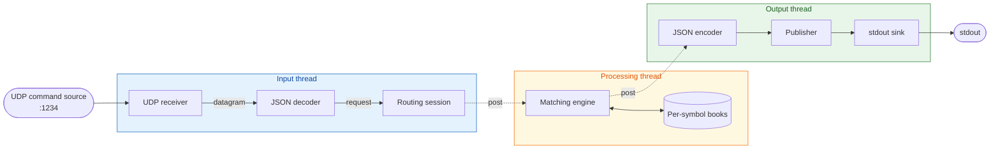
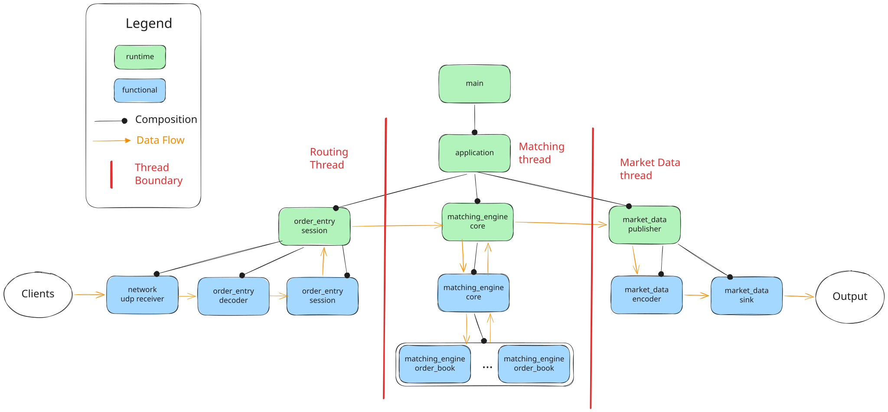

# matching-engine-lab

Multi-threaded UDP order book matching engine, built as a C++26 systems
portfolio project with the local GCC 16 toolchain documented in
[`DEVELOPING.md`](DEVELOPING.md).

Core matching logic lives in the `matching_engine` module.

## Architecture

Data flows from inbound UDP packets through the matching engine and out
as market data, with SPSC queues between thread boundaries, driven by
spinning event loops.

### Conceptual data flow



### Application Composition Tree



## Highlights

- **Hot-path conscious.** The matching core uses direct cancellation,
  intrusive resting-order nodes, and pre-sized runtime structures; the
  benchmark suite will be rebuilt after the current reframe settles.
- **Resilient.** Clean build under GCC and Clang, with all sanitiser
  combinations green and zero warnings against a flag set well beyond
  `-Wall -Wextra`.
- **Modular.** Every pipeline stage -- including the UDP backend and
  the matching engine itself -- plugs in behind a typed seam and
  swaps without touching the rest of the code.
- **Safe by design.** Strong types, exhaustive switches, structured
  errors, and a clean runtime / domain split move whole classes of
  bug to compile time.
- **Configurable.** Reshape the system -- threading, idle strategies,
  backends, sinks -- by changing config, not code.

See [`docs/highlights.md`](docs/highlights.md) for the longer version.

## Threading model

Three threads, each running a `lab::event_loop` whose primary
queue is a single-producer / single-consumer blocking queue. The
producing thread `post()`s a closure onto the consuming thread's
loop; the consumer dequeues and runs the closure synchronously on
its own thread.

Each loop's idle behaviour -- what the consumer does when both the
task queue and the pollers are empty -- is selected per loop through
`lab::event_loop_config::idle_strategy`. The server is an HFT-style
pipeline, so `server::config` defaults all three loops to
`lab::busy_spin_idle`: the consumer never sleeps, never wakes, and
the next iteration starts as soon as the previous one ends. The
loop primitive itself defaults to `lab::timed_wait_idle` for
non-HFT consumers.

| Thread | Stages it owns | Notes |
|--------|----------------|-------|
| Input | UDP receiver, JSON decoder, order-entry session | The asio `io_context` runs as a non-blocking poller against the same loop, so datagrams advance in line with posted tasks. |
| Processing | Matching engine, per-symbol books | Pure synchronous chain over posted requests; no pollers. |
| Output | JSON encoder, publisher, stdout sink | The publisher is the sole writer of stdout, so no per-record locking. |

Inside any one thread, the stages run as a direct synchronous chain;
no stage knows it lives behind an event loop.

## Components

Each library has its own README; click through for the responsibility
statement and the pointers to the ADRs that explain its shape.

| Library | Role |
|---------|------|
| [`lab`](src/lab/) | General-purpose utilities ("our internal Boost"). |
| [`order_entry`](src/order_entry/) | Inbound domain. UDP bytes to typed order-entry requests. |
| [`order_client`](src/order_client/) | Typed client library. Order-entry requests to UDP JSON datagrams. |
| [`matching_engine`](src/matching_engine/) | The main trading domain. Per-symbol order books and the matching loop. |
| [`market_data`](src/market_data/) | Outbound domain. Typed messages to JSON records on stdout. |
| [`mor`](src/mor/) | Normalized order-routing messages and callback interfaces. |
| [`morfix`](src/morfix/) | Canonical FIX-shaped rendering of `mor` order flow, with reverse conversion back to normalized routing messages. |
| [`ospec`](src/ospec/) | Venue tag and value normalization; currently B3. |
| [`quickfix_fix`](src/quickfix_fix/) | Local QuickFIX-compatible message, text codec, and in-memory session boundary. |
| [`morfix_quickfix`](src/morfix_quickfix/) | B3 codec glue between `morfix`, `ospec`, and the FIX boundary. |
| [`mmd`](src/mmd/) | Normalized market-data events. |
| [`mmd_json`](src/mmd_json/) | JSON rendering for normalized market-data events. |
| [`mmdfix`](src/mmdfix/) | Canonical FIX-shaped market-data records. |
| [`mmd_transport`](src/mmd_transport/) | Encoded market-data delivery boundaries. |
| [`server`](src/server/) | Wiring shell. Owns the three event loops and the executable. |
| [`client`](src/client/) | CLI sender for scenario files or stdin. |

Where it helps to see a library used in isolation, a runnable example
program lives alongside it (under the library's own `examples/`
directory). The per-library README points at its examples.

## Where to read next

| You want... | Open... |
|-------------|---------|
| The matching engine behavior | [`docs/engine-specs.md`](docs/engine-specs.md) |
| The technical pitch in one page | [`docs/highlights.md`](docs/highlights.md) |
| How the project thinks about C++ | [`docs/cpp-design-principles.md`](docs/cpp-design-principles.md) |
| Showcase of applied principles in code | [`docs/showcase.md`](docs/showcase.md) |
| Architectural decisions with full reasoning | [`docs/adr/`](docs/adr/) |
| Codec layering decision | [`docs/adr/0005-layer-codecs-behind-normalized-routing-and-market-data-domains.md`](docs/adr/0005-layer-codecs-behind-normalized-routing-and-market-data-domains.md) |
| A map of the source tree | [`INDEX.md`](INDEX.md) |
| How the application wires itself together at startup | [`docs/runtime-startup.md`](docs/runtime-startup.md) |
| The event loop primitive each thread runs | [`docs/event-loop.md`](docs/event-loop.md) |
| Dependency strategy and inventory | [`DEPENDENCIES.md`](DEPENDENCIES.md) |
| Build presets and developer setup | [`DEVELOPING.md`](DEVELOPING.md) |
| How to tune the host for production-grade latency | [`docs/tuning-guide.md`](docs/tuning-guide.md) |

## Quick Start

Build the project and run the unit tests:

```bash
./build.sh                                # debug preset, all targets, run tests
./build.sh release server                 # optimized server binary
./build.sh release client                 # optimized client binary
```

Run the UDP server and send commands:

```bash
./_build/debug/server --host 127.0.0.1 --port 1234
./_build/debug/client --host 127.0.0.1 --port 1234 --input examples/scenarios/crossing-orders.jsonl
```

The server listens for JSON order commands over UDP and writes market data
records to stdout. Use `ctest --test-dir _build/debug --output-on-failure`
when you want to rerun the test suite without rebuilding.

## Local Development

`build.sh` wraps CMake configure, build, and `ctest`:

```bash
./build.sh                                # debug preset, all targets, run tests
./build.sh release                        # optimized build
./build.sh asan server                    # named preset and target
./build.sh asan client                    # named preset and target
```

See [`DEVELOPING.md`](DEVELOPING.md) for setup, available presets, and
project conventions.

## Layout

```
.
|-- examples/           Demo scenario inputs and expected market-data output
|-- b3-*.xml            B3 reference protocol files for codec scaffolds
|-- src/               Libraries and client/server applications
|-- test/              Unit tests
|-- vendor/            CMake FetchContent dependency declarations
|-- cmake/             Shared CMake modules
|-- scripts/           Developer scripts (formatting, pre-commit)
|-- docs/              ADRs, C++ design principles, engine spec, runtime and event-loop docs
|-- build.sh           CMake configure + build + ctest wrapper
`-- setup.sh           Local toolchain and hook setup
```
