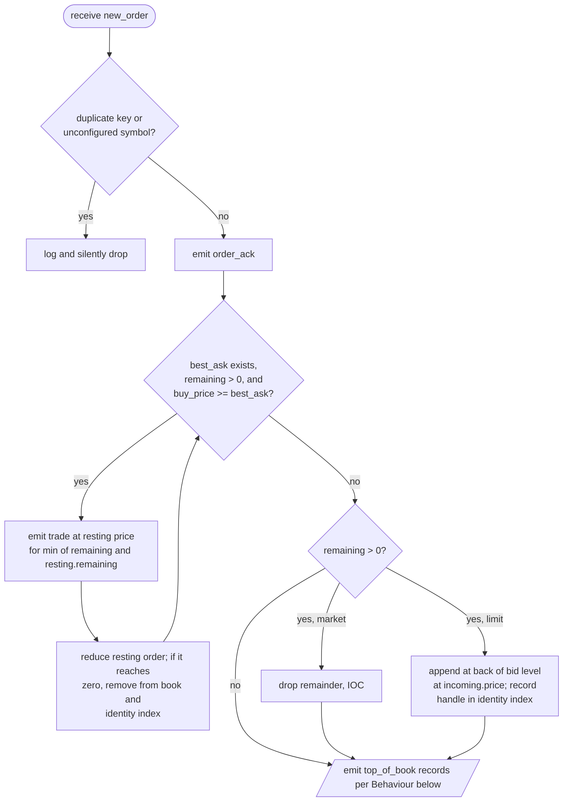

# Engine specification

The matching engine accepts `order_routing::request` values and emits
`market_data::message` events. The runtime guarantees a single
thread drives it.

The request variant has three alternatives:

- `new_order` -- buy or sell with a limit price, or market when
  `price == 0`.
- `cancel_order` -- remove a resting order by `(user, user_order_id)`.
- `flush` -- clear every book silently.

## Data structures

### Per-symbol order book

One book per configured symbol, with two sides:

- **Bids** are price-ordered descending; the front is the best bid.
- **Asks** are price-ordered ascending; the front is the best ask.
- Within a price level, orders are kept in arrival order
  (price-time priority).

The current shape uses sorted price-level maps over intrusive lists
of pool-allocated nodes. See
[ADR 0004](adr/0004-keep-order-book-as-sorted-price-level-maps.md)
and
[`matching_engine/v3/order_book.hpp`](../submission/src/matching_engine/matching_engine/v3/order_book.hpp).

### Identity index

A single cross-symbol map from `(user, user_order_id)` to the
resting node. New orders consult it for duplicate rejection;
cancels consult it to locate a resting order without scanning
books. Entries are erased when orders leave a book. The per-symbol
books carry no identity index of their own; the engine is the only
owner.

## Request handling

### new_order

The flowchart below traces an aggressing buy. A sell mirrors it
with the bid side as the resting side.

Two `top_of_book` emissions may follow, in this order:

1. If any trade occurred, one for the **opposite** side -- the side
   liquidity was consumed from.
2. If a residual was placed *and* it rests at the new best on its
   own side, one for the **own** side.

### cancel_order

If the key is unknown, the cancel is silently dropped. Otherwise
the engine snapshots the best price on the resting order's side,
removes the order (tearing down the level if it was the last
order), erases the identity entry, and emits `cancel_ack`. When
the snapshot equals the cancelled order's price the cancel mutated
the top and a `top_of_book` follows.

### flush

Drains every book and emits nothing. The book map keeps its
configured symbols alive so later commands keep finding their
books -- only the contents are discarded.

`EXERCISE.md` defines `F` only as "reset all order books" and is
silent on the observable consequence. The fixtures settle it: `F`
appears only as the final command in every scenario, and no
odd-numbered expected output carries a top-of-book record that
resting interest at flush time would otherwise produce. The
downstream consumer treats `F` as a session reset whose effect it
observes through the absence of further records.

## Behaviour

### Market vs limit

`price == 0` is the wire-level sentinel for a market order. Market
orders cross every resting price; limit orders cross only when the
taker is at or better than the resting price. Market remainders are
dropped (IOC); limit remainders rest.

### Trade

One `trade` per match, at the resting price (price improvement for
the taker). The buy/sell user and order identifiers come from the
two sides of the match, not from the taker's identity:

- Taker buy against a resting ask: buy = taker, sell = maker.
- Taker sell against a resting bid: buy = maker, sell = taker.

### Top of book

A `top_of_book` reports the **affected side** -- for a cross, the
side liquidity was consumed from, i.e. the opposite of the taker.
The record carries the affected side's new best price and aggregate
quantity at that price; when the side is empty, both fields are
absent and the wire formatter renders them with `-`.

Emissions by request:

- `new_order` -- opposite side after any trades; own side iff a
  residual was placed at the new best.
- `cancel_order` -- cancelled order's side iff the pre-cancel best
  equalled the cancelled order's price.
- `flush` -- never.

### Acknowledgement ordering

`order_ack` precedes every trade and top-of-book record produced
by the same `new_order`. `cancel_ack` follows the book mutation,
so a `top_of_book` produced by the same cancel comes after it.
