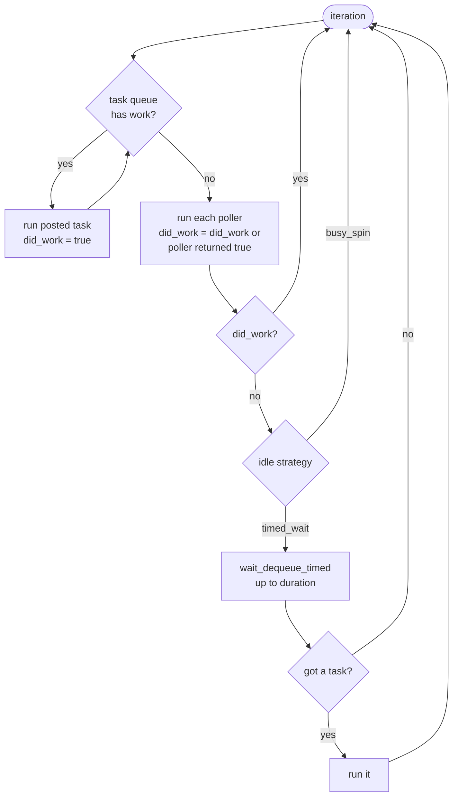
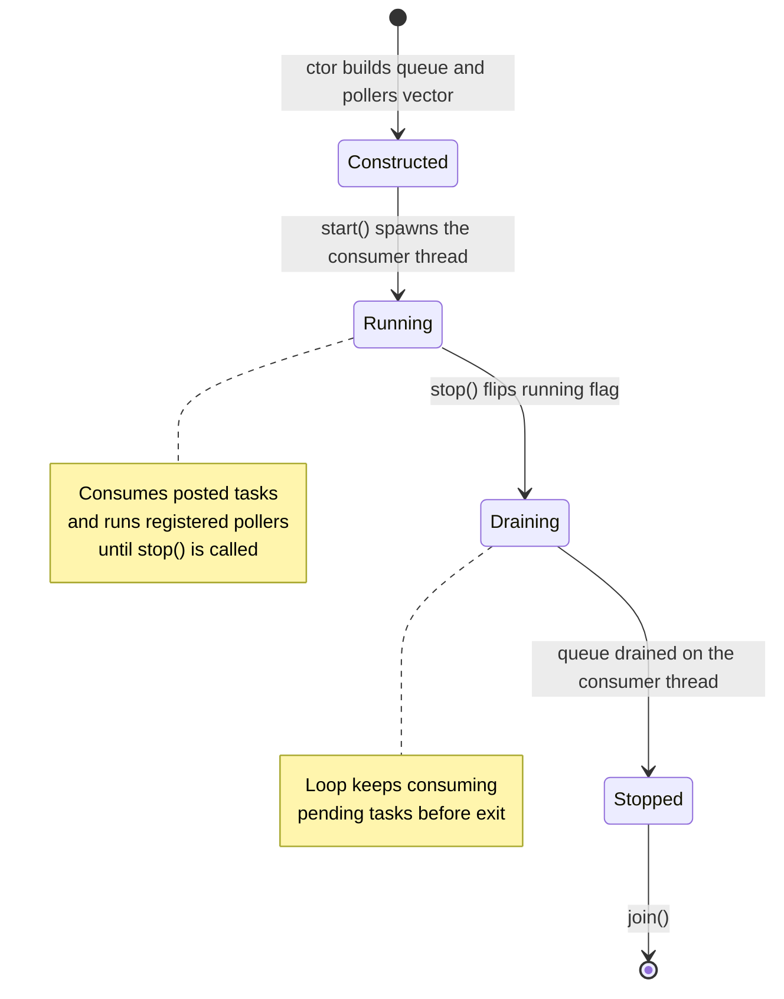

# Event loop

The runtime layer pins one [`lab::event_loop`](../src/lab/lab/event_loop.hpp)
to each of the three threads in the server topology. Each loop
is a single consumer thread, an SPSC blocking queue of posted
closures, and an optional vector of pollers. Stages attached to a
loop see single-thread execution, ordered cross-thread delivery, and
a non-blocking `post` -- that is what lets the domain libraries stay
synchronous and lock-free.

The chronological setup path that brings the loops online is in
[`runtime-startup.md`](runtime-startup.md).

## Two integration points

A stage attaches to a loop in two ways: a cross-thread `post` for
work that originates on another thread, and an in-thread poller for
work that has nowhere else to run.

| Mechanism | Cardinality | Direction | Used by |
|-----------|-------------|-----------|---------|
| `post(closure)` | one producer, one consumer | producer thread to consumer thread | `application::wire_pipeline` to hand off `order_routing -> matching_engine` and `matching_engine -> market_data` events |
| `add_poller(callback)` | many pollers per loop | in-thread, called every iteration | `application::wire_pipeline` registers a closure that calls `order_routing::runtime::session::poll()` on the input loop, so the asio `io_context` (or a kernel-bypass `poll()` tick) advances in line with posted work |

`post` is `noexcept` and returns `void`. The blocking SPSC queue's
`enqueue` only fails on allocation failure; recovery is not
meaningful at this layer, so `post` asserts the enqueue succeeded
and aborts on failure. Producing stages call it directly and treat
the post as infallible.

A poller is a callable returning `bool` -- `true` when it did work
this iteration. The loop uses that signal to decide whether to keep
spinning or sleep. Pollers run on the consumer thread and have no
return path for errors.

## One iteration

Each iteration drains the task queue, runs every registered poller,
and falls back to the configured idle strategy only if neither
produced work. The strategy is picked once at `start()` and held for
the lifetime of the loop:

| Strategy | Behaviour when idle | When to pick it |
|----------|---------------------|-----------------|
| `lab::timed_wait_idle` | `wait_dequeue_timed` parks the thread on the task queue for up to `duration` (default 1 ms). Wakes early if a producer posts. | The kinder default; one core is not burned per idle loop. Fine for control planes, tests, and non-HFT consumers. |
| `lab::busy_spin_idle` | The loop loops. No sleep, no condition variable, no syscall. The thread sits at 100% CPU. | The HFT default in `matching_engine_lab_server::config`. Removes wake-up latency from the cross-thread hop and from poller-driven UDP ingestion. |

The full iteration under either strategy:

Three properties fall out of this shape:

- **Single-threaded execution.** Posted tasks and pollers all run on
  the consumer thread. This is what lets the matching engine skip
  atomics and mutexes and the receiver share a thread with the input
  loop instead of spinning its own.
- **Pollers checked every iteration.** A poller runs at least as
  often as the loop wakes; the asio `io_context` and a kernel-bypass
  `poll()` tick get the same treatment as a posted task.
- **Idle behaviour is a per-loop choice.** Under `timed_wait_idle`
  latency is bounded by `duration`. Under `busy_spin_idle` there is
  no idle path at all -- the next iteration begins as soon as the
  previous one ends, so latency tracks the cost of a cache-hot queue
  probe.

## Lifecycle

The loop is a one-shot object. `start()` may only be called once;
`stop()` is idempotent and safe from any thread.

The `Draining` state matters for shutdown ordering: `stop()` flips
the running flag, and the consumer's next iteration check exits the
main loop and runs one final `try_dequeue` pass before the thread
returns. The acquire-load that observed the flag synchronises with
the controller's release-store -- which `application::stop` only
issues after `join`ing the upstream producer -- so every closure
the producer ever enqueued is visible to that final drain. This
lets `application::stop` tear down inbound-to-outbound: by the time
`input_loop.join()` returns, every closure already posted onto the
processing loop is queued or running, never silently dropped.

## What else stages can assume

Beyond single-threaded execution, the loop also guarantees:

- Posts from another thread arrive in producer-enqueue order. With
  one producer per cross-thread edge, that is also the order the
  consumer observes.
- Pollers run in registration order each iteration. There is no
  ordering guarantee between a poller and a posted task in the same
  iteration; both run before the next idle decision.
- The loop never blocks the producing thread. `post` is non-blocking;
  the only failure mode of the underlying enqueue is queue-allocation
  failure, which aborts the process.

## See also

- [`runtime-startup.md`](runtime-startup.md) -- the chronological
  view of how each loop is started and wired.
