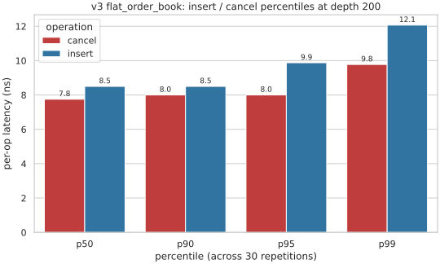

# v3 order book performance

Per-op latency characterisation of `matching_engine::v3::flat_order_book`
-- the production book -- on a single-symbol, single-price-level workload.
The chart tracks p50 / p90 / p95 / p99 insert and cancel latency at a
representative 200 resting orders.

The numbers below come from
[`scripts/collect_performance_data.sh`](../scripts/collect_performance_data.sh)
on the environment recorded in
[`benchmarks/README.md`](../benchmarks/README.md#environment).

## Headline

At 200 resting orders, the production book reports ~12 ns/op p99
insert latency and ~10 ns/op p99 cancel latency across 30 repetitions.
p50/p90 land at ~8.5 ns/op insert and ~8 ns/op cancel, so the run-to-run
spread is tight.

## Latency distribution at depth 200



| Percentile | Insert (ns/op) | Cancel (ns/op) |
| ---------- | -------------: | -------------: |
| p50        |           8.50 |           7.75 |
| p90        |           8.50 |           8.00 |
| p95        |           9.88 |           8.00 |
| p99        |          12.07 |           9.78 |

Both distributions stay tight through p90. Insert widens at p95/p99
where the underlying `flat_map` occasionally pays a `std::sort`-style
fix-up on the side-map; cancel stays flat because the cancel path is
an intrusive O(1) unlink and the only side-map mutation (the final
level erase) is amortised across the 200-iteration drain.

## Methodology

The chart comes from a single google-benchmark binary
([`benchmarks/order_book`](../benchmarks/order_book))
running two repeated benchmarks at the 200-order reference depth:

- `BM_PlaceGrowingLevel` -- fills an empty level with 200 orders, one
  order per iteration; the per-iteration CPU time is the per-op
  insert cost averaged across depth 0..200 within one repetition.
- `BM_CancelDrainingLevel` -- pre-places 200 orders on an empty level
  in Setup, then cancels them one per iteration in the timed loop;
  the per-iteration CPU time is the per-op cancel cost.

Both benchmarks use the Setup-per-repetition shape: Setup builds a
fresh fixture, pre-builds the workload, and (for the growing-level
side) cycles the workload through the book once to warm the
`boost::pool` slab. Each benchmark is registered with
`Iterations(200) -> Repetitions(30)` and the four `ComputeStatistics`
aggregators (p50, p90, p95, p99) alongside the default mean / median /
stddev. **Caveat on the percentiles:** google-benchmark reports one
number per repetition, where each number is itself a mean across the
200 iterations of that repetition. The percentiles therefore describe
run-to-run dispersion at a fixed load, not per-call tail latency. For
a true per-call distribution the benchmark would need manual rdtsc
timing, which the user-facing google-benchmark harness intentionally
avoids.

## Reproduce

1. Build the release benchmark:

   ```bash
   ./build.sh release matching_engine_order_book_benchmark
   ```

2. Refresh the cached JSON under `docs/performance/data/`:

   ```bash
   ./scripts/collect_performance_data.sh
   ```

   `MIN_TIME` (default `0.5s`) is exposed for parity with other
   google-benchmark drivers but has no effect here: the registrations
   use `Iterations(K)` so per-repetition iteration count is fixed.

3. Re-render the SVG:

   ```bash
   ./scripts/render_performance_charts.py
   ```

   The rendering step is a pure transformation over the cached JSON and
   takes a few seconds end-to-end (uv resolves the pandas / seaborn /
   matplotlib deps into an ephemeral environment via PEP 723).

See [`DEVELOPING.md`](../DEVELOPING.md#refreshing-the-performance-charts)
for the workflow summary.
