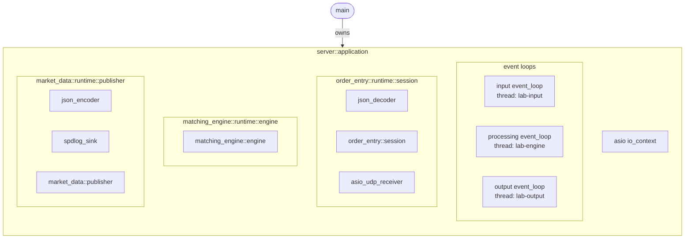

# Runtime startup

`application::start` brings the pipeline online in three phases:

1. **`setup`** instantiates every backend and stage,
   inbound-to-outbound.
2. **`wire_pipeline`** ties the stages together with cross-thread
   post closures.
3. **`start`** spins up the threads outbound-to-inbound, so each
   consumer loop is running before its producer can post to it.

Each phase depends on the prior: backends must exist before their
`on_*` fields can be bound, and both must be in place before any
datagram arrives. The reverse direction in phase 3 is the safety
property -- output runs before processing posts to it, and
processing runs before input posts to it. `application::stop`
walks the same chain backwards.

The `event_loop` primitive each thread runs is documented in
[`event-loop.md`](event-loop.md); this document assumes that as
background.

## Composition

`main` reads a JSON app config and constructs one
[`server::application`](../src/server/server/application.hpp) from the parsed
[`config`](../src/server/server/application.hpp). The application owns the
three event loops and the three runtime composers. Each composer owns the
concrete backends its config variant selects -- a UDP receiver, a decoder, an
encoder, a sink -- and exposes the stage as a `send` / `on_*` boundary.

The receiver, decoder, encoder, and sink shapes shown here are the
backends the current `config` selects. Adding a kernel-bypass
receiver or a binary encoder is a config change, not a composition
change -- the composer's variant dispatch picks the alternative and
the rest of the box stays as drawn.

## Startup sequence

The diagram traces the full call chain through the three phases;
the sections below drill into each.

```mermaid
sequenceDiagram
  autonumber
  participant main
  participant app as application
  participant routing as order_entry::runtime::session
  participant engine as matching_engine::runtime::engine
  participant publisher as market_data::runtime::publisher
  participant input as input loop
  participant processing as processing loop
  participant output as output loop

  main->>main: read JSON config file
  main->>app: construct(config)
  Note over app,output: ctor builds the three event loops in member init

  main->>app: start()
  app->>app: configure_logger()
  app->>app: emplace io_context if asio receiver

  app->>routing: setup(config, io_context*)
  routing->>routing: build decoder, inner session, receiver

  app->>engine: setup(config)
  app->>publisher: setup(config)

  app->>app: wire_pipeline()
  Note over app,output: bind on_request and on_event to cross-thread post closures
  app->>input: add_poller([&] { return routing.poll()&#59; })

  app->>routing: start()
  Note over routing: bind UDP socket -- failure surfaces before any thread spins up

  app->>output: start()
  app->>processing: start()
  app->>input: start()
  Note over output,input: outbound-to-inbound so each stage's downstream is live
```

## Phase 1: `setup`

Each composer's `setup(config)` constructs the backends its variant
selects, threads them into the inner stage, and forwards the stage's
typed `on_*` callbacks out as the composer's own `on_*` fields.

`order_entry` additionally takes a `boost::asio::io_context*`. The
asio receiver's socket needs one, and the wiring shell decides which
thread drives it, so the application owns the context and threads it
through. The ef_vi alternative passes a null pointer through the same
slot. The matching engine and publisher have no background work, so
their composers take only a config.

The receiver still needs work driven on the input thread without
owning a thread of its own. The composer exposes a `poll()` method
rather than reaching for the loop directly, so the "which loop drives
what" decision stays in the wiring shell and the composer carries no
event-loop type.

## Phase 2: `wire_pipeline`

Rebinds `order_entry.on_request` and `engine.on_event` to closures
that `post(...)` onto the next loop. These two hops -- input to
processing, and processing to output -- are the only places domain
values cross thread boundaries. Each `on_*` is a
`lab::inplace_function`, so the closure stores inline; see
[Performance discipline](cpp-design-principles.md#performance-discipline).

The same step registers `order_entry_.poll()` on the input loop via
`add_poller`: the receive-side counterpart to the post closures, kept
in the wiring shell for the same reason.

## Phase 3: `start` (outbound-to-inbound)

`order_entry.start()` binds the UDP socket first. Bind can fail
(port in use, permissions) and the failure has to surface before the
application reports success. The bound socket is inert until the
input loop ticks `poll_one`, so opening it early is safe.

The loops then start outbound-to-inbound -- output, processing,
input -- so each consumer is live before its producer can post to
it. `application::stop` walks the chain backwards: stop the receiver,
drain input, drain processing, drain output, flush the publisher.
[`run`](../src/server/src/application.cpp) joins
the three threads after the signal handler asks them to stop.

## See also

- [`event-loop.md`](event-loop.md) -- the loop primitive each thread
  runs.
