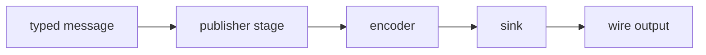

# market_data

Outbound-edge domain library. Turns typed market-data messages into
wire-format records and hands them to a sink. Pure synchronous code
over value types.

## Components

- An outbound message vocabulary for the events the system publishes
  (order and cancel acknowledgements, trades, top-of-book changes).
- A wire-format encoder: a synchronous, allocation-light formatter
  that produces records without trailing framing -- the sink decides
  how records are separated.
- A pipeline-stage publisher that drives the encoder on the outbound
  edge.
- A sink boundary, so the same formatter can feed any single-threaded
  line-oriented transport.

## Composition

