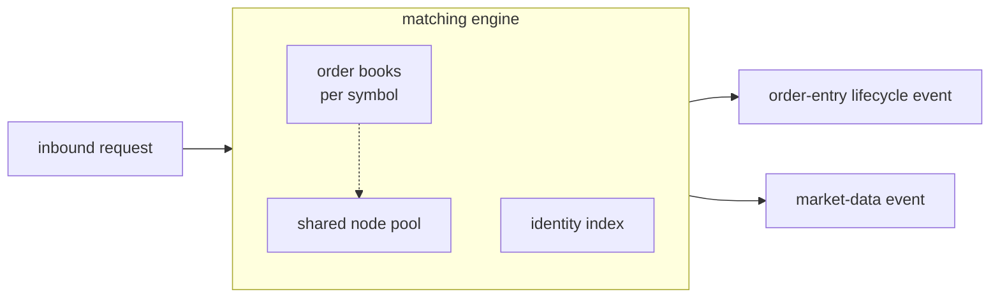

# matching_engine

Owns the per-symbol order books and the matching loop -- the business
logic at the centre of the system. Consumes order-entry requests and
emits order-entry lifecycle events separately from market-data events.
Pure synchronous code over value types.

## Components

- A matching engine that dispatches inbound commands and runs the
  matching loop. Production uses `v3` through the top-level
  `matching_engine::engine` alias. The observable spec lives in
  [`docs/engine-specs.md`](../../../docs/engine-specs.md). The internal
  topology and request lifecycle live in
  [`docs/architecture.md`](docs/architecture.md).
- A per-symbol order book. The data-structure choice is recorded in
  [ADR 0004](../../../docs/adr/0004-keep-order-book-as-sorted-price-level-maps.md).
  Three implementations ship in-tree under `v1/`, `v2/`, `v3/`;
  production uses `v3` (templated, intrusive list over
  `boost::container::flat_map`) through the top-level
  `matching_engine::order_book` alias. `v1` (naive vector-per-level)
  and `v2` (intrusive list with caller-owned pool) stay in-tree as
  benchmark and test references.
- A cross-symbol identity index used for cancellation and replacement
  lookups.
- A shared pool that owns resting-order node storage across every
  book.

## Composition

