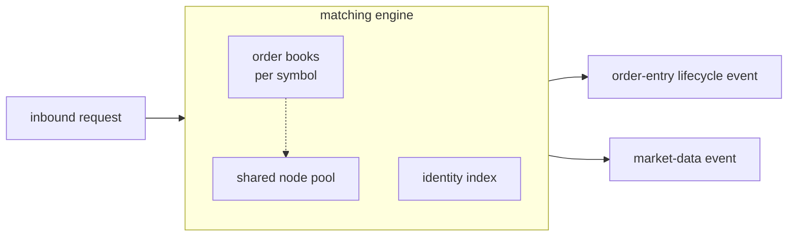

# matching_engine

Owns the per-symbol order books and the matching loop -- the business
logic at the centre of the system. Consumes order-entry requests and
emits order-entry lifecycle events separately from market-data events.
Pure synchronous code over value types.

## Components

- A matching engine that dispatches inbound commands and runs the
  matching loop. The observable spec lives in
  [`docs/engine-specs.md`](../../../docs/engine-specs.md). The internal
  topology and request lifecycle live in
  [`docs/architecture.md`](docs/architecture.md).
- A per-symbol order book. The data-structure choice is recorded in
  [ADR 0004](../../../docs/adr/0004-use-flat-price-level-maps-with-intrusive-pooled-orders.md).
  The production book is a templated intrusive-list structure over
  `boost::container::flat_map`, exposed as `matching_engine::order_book`.
- A cross-symbol identity index used for cancellation and replacement
  lookups.
- A shared pool that owns resting-order node storage across every
  book.

## Composition

