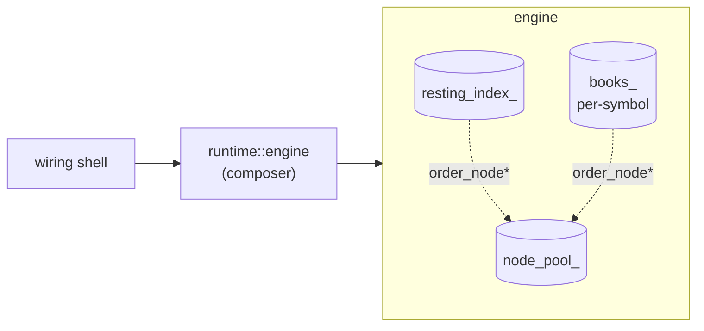

# Matching engine architecture

Internal shape of the matching engine: how the runtime composer, the
engine, and the per-symbol books are layered, who owns the
`order_node` storage, and where the matching algorithm lives.
Observable behaviour is specified in
[`docs/engine-specs.md`](../../../../docs/engine-specs.md); the
data-structure choice is recorded in
[ADR 0004](../../../../docs/adr/0004-keep-order-book-as-sorted-price-level-maps.md).

## Layers

- **Runtime composer** (`matching_engine::runtime::engine`).
  Wiring-shell entry point. Holds an `optional<engine>` and exposes
  `setup` / `send` / `on_event`. Construction can fail without
  leaving a half-built composer behind.
- **Engine** (`matching_engine::v3::engine`). Synchronous domain
  object. Owns the pool, the cross-symbol identity index, and the
  per-symbol books. Dispatches each `request` variant through
  `lab::match` to a typed `handle()` overload.
- **Order book** (`matching_engine::v3::flat_order_book`). Pure data
  structure: two side maps of `price -> price_level`, each level a
  FIFO of `order_node` with a running `total_remaining`. `place` and
  `cancel` operate on engine-owned handles; the book only links and
  unlinks.

## Engine-owned lifetime

The engine is the single point of authority on every `order_node`.
Books hold node addresses but never construct or destroy them, and
the index holds the same addresses from a second direction.

- **`node_pool_`** -- one `boost::pool` for the whole engine, sized
  from `expected_resting_orders` at startup so the steady-state path
  pops slots off the free list. Cross-symbol by design: a slot freed
  by a shallow book is immediately available to a deep one, so
  resident memory tracks total resting count rather than the sum of
  per-symbol caps.
- **`resting_index_`** -- the single `(user, user_order_id)` ->
  `order_node*` map. Cancel resolves to a node in one hop; new
  orders consult it for duplicate detection. Cross-symbol uniqueness
  is a protocol invariant, so the index is engine-wide rather than
  per-book.
- **`books_`** -- one `flat_order_book` per configured symbol,
  preallocated from `valid_symbols`. The container is a node map:
  the matching loop holds a book reference across callback
  emissions, so references must survive growth.
- **`order_node` slots** -- raw pool memory, placement-new on
  `allocate_node`, explicit destructor plus `pool.free` on
  `release_node`. The intrusive-list layout keeps node addresses
  stable for the resting order's lifetime, which is what makes the
  index safe to hold raw pointers.

Shutdown leaves resting nodes linked and lets the pool reclaim its
slabs in one shot. A `static_assert` on `order_state` pins the
trivial destructibility that makes this safe; the intrusive hook
uses `normal_link` so book destructors don't trip on still-linked
elements at teardown. See
[`order_node.hpp`](../matching_engine/v3/order_node.hpp) for the
full lifetime argument.

## Matching as a free function

[`matching.hpp`](../matching_engine/v3/matching.hpp) defines `match`
as a function template parameterised on the side-map type, a cross
predicate, and `on_trade` / `on_release` callbacks. It walks levels
from best outward, bulk-erases the consumed prefix in one range
erase, and returns an `execution_summary` of trade count and last
traded price.

The engine picks the map to walk (asks for buy takers, bids for
sell) and adapts its own `on_event` and `release_node` into the
callback shapes at the call site. The algorithm sees only side maps
and callbacks, so unit tests drive it directly against recording
lambdas without spinning up an engine.
