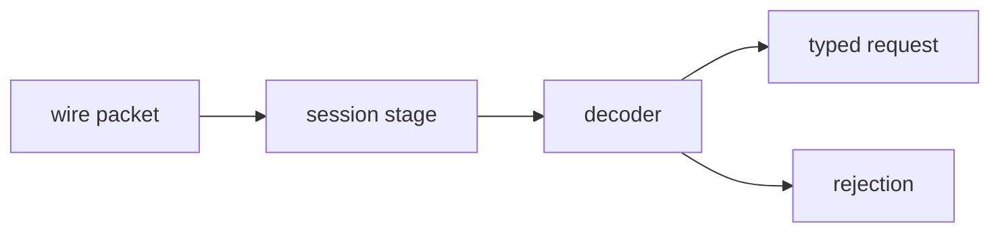

# order_entry

Inbound-edge domain library. Turns framed wire bytes into typed
order-entry requests through pure synchronous code over value types.

## Components

- A request and lifecycle-event vocabulary for order-entry messages:
  `new_order_single`, `replace_order`, `cancel_order`,
  `execution_report`, and `cancel_reject`.
- Strong-typed primitives for the fields those requests carry
  (identifiers, prices, quantities, sides, symbols), so neighbouring
  fields cannot be silently transposed at a call site.
- A wire-format decoder that parses framed bytes into the request
  vocabulary. The JSON command protocol is recorded in
  [`docs/engine-specs.md`](../../../docs/engine-specs.md).
- A pipeline-stage session that drives the decoder and emits either a
  typed request or a structured rejection.
- An error vocabulary raised at the decoder boundary.

## Composition

The narrow contract the decoder treats as a precondition is recorded in
[`docs/engine-specs.md`](../../../docs/engine-specs.md).
