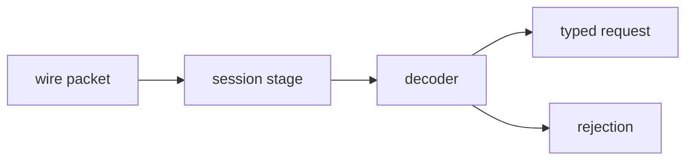

# order_routing

Inbound-edge domain library. Turns framed wire bytes into typed routing
requests through pure synchronous code over value types.

## Components

- A request vocabulary for the inbound commands the system accepts.
- Strong-typed primitives for the fields those requests carry
  (identifiers, prices, quantities, sides, symbols), so neighbouring
  fields cannot be silently transposed at a call site.
- A wire-format decoder that parses framed bytes into the request
  vocabulary. The fixed-shape parsing convention is recorded in
  [ADR 0003](../../../docs/adr/0003-parse-csv-as-fixed-shape-commands.md).
- A pipeline-stage session that drives the decoder and emits either a
  typed request or a structured rejection.
- An error vocabulary raised at the decoder boundary.

## Composition

The narrow contract the decoder treats as a precondition is recorded in
[ADR 0003](../../../docs/adr/0003-parse-csv-as-fixed-shape-commands.md).
