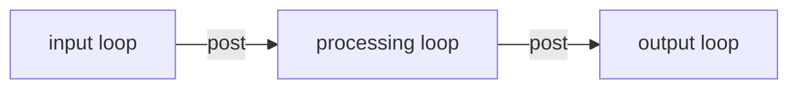

# server

Wiring shell. The thin executable that brings the three pipeline
runtimes online, pins each to its own thread, and marshals the
cross-thread hops between them. Every domain decision lives in the
libraries it composes.

## Components

- An application object that owns the three event loops and the three
  pipeline runtime composers, and exposes the lifecycle (`start` /
  `run` / `stop`).
- A configuration shape that selects backends at composition time --
  the inbound receiver, the outbound sink, the logger, and the
  per-thread names. Swapping any of them is a config change, not a
  wiring change.
- Cross-thread post lambdas that turn one stage's output into the
  next stage's input on the receiving loop.
- A startup and teardown ordering that brings the pipeline up
  outbound-to-inbound and reverses it on shutdown, so a stage is
  never receiving work before its downstream is ready.
- An entry point that translates process signals into application
  lifecycle.

## Composition

Each loop hosts one pipeline runtime; the boxes are threads, the
arrows are the cross-thread queues. The library-plus-thin-executable
convention is recorded in
[ADR 0001](../../docs/adr/0001-cpp-project-layout.md); the
threading model lives in the
[top-level README](../../README.md) and
[`docs/event-loop.md`](../../docs/event-loop.md).

The chronological wiring path -- who instantiates what, who
registers pollers on which loop, which order things start in --
is in [`docs/runtime-startup.md`](../../docs/runtime-startup.md).
The loop primitive itself, including the two integration points
(`post` and `add_poller`) and the iteration shape, is in
[`docs/event-loop.md`](../../docs/event-loop.md).
